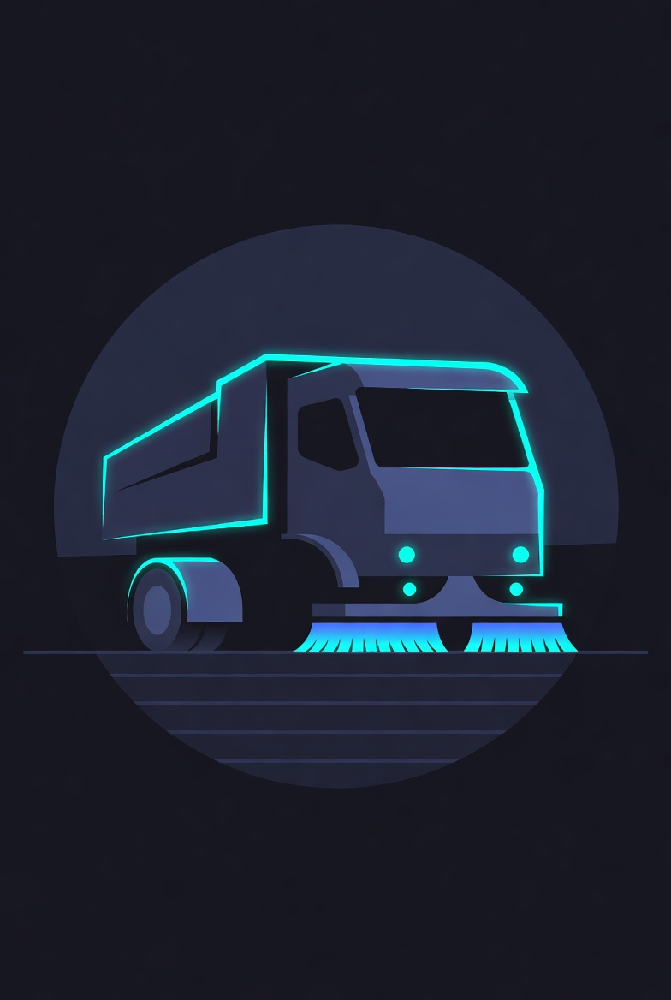

<p align="center">
  
</p>

<h1 align="center">Fleetsweeper</h1>

<p align="center">
  Drift detection for everyone running more than one Kubernetes cluster.
</p>

<p align="center">
  <a href="https://github.com/dcadolph/fleetsweeper/actions/workflows/ci.yml"></a>
  <a href="https://github.com/dcadolph/fleetsweeper/releases/latest"></a>
  <a href="https://pkg.go.dev/github.com/dcadolph/fleetsweeper"></a>
  <a href="LICENSE"></a>
  <a href="https://github.com/dcadolph/fleetsweeper/discussions"></a>
</p>

---

You run twelve clusters. Or fifty. Or two hundred. They started identical
and they did not stay that way. Versions skew. Admission policies drift.
Service accounts get patched at 3am and nobody writes it down. The next
outage will start in the cluster that quietly stopped looking like the
others, and your existing tools will not warn you, because each one of
those clusters is "healthy" on its own.

Fleetsweeper finds the cluster that drifted. It scans the fleet, treats
the majority as the norm, and surfaces the one that wandered off. No
rulebook to write. No static thresholds to tune. The fleet itself is
the baseline.

**What you walk away with after one scan.**

- A Fleet Score from 0 to 100, with a one-line headline you can put on a status TV.
- The cluster that is most unlike the rest, plus the specific fields where it diverges.
- Ranked, leverage-weighted recommendations. The fix that takes ten clusters from drifted to clean ranks ahead of the same fix on one cluster.
- An optional admission webhook that warns or denies pods that deviate from the fleet's actual norm, with the bar derived from your fleet, not from PSS guesswork.
- One unified stream for inbound signal: scan findings, AlertManager, Falco, Trivy CVEs, Kyverno and Gatekeeper [PolicyReports](https://github.com/kubernetes-sigs/wg-policy-prototypes). One place to triage, one SSE bus, one ack workflow.

## See it running

```
fleetsweeper serve --demo --addr :8080
```

Open `http://localhost:8080`. A synthetic 26-cluster fleet renders across
four continents with globe, findings, trends, outliers, capacity, and a
guided tour. No kubeconfig required. The pulsing red dots are the cinematic
part. The [modified z-score](https://en.wikipedia.org/wiki/Median_absolute_deviation)
outlier detection under them is the real part.

## Install it for real

```
kubectl apply -f deploy/crds/clusterscan.yaml
helm install fleetsweeper deploy/helm/fleetsweeper \
  --set auth.token=$(openssl rand -hex 32) \
  --set controller.enabled=true
kubectl apply -f deploy/examples/clusterscan-prod.yaml
```

The controller reconciles `ClusterScan` resources, triggers scans on their
declared interval, and writes the outcome back to `.status`. `kubectl get
clusterscan` shows live phase, score, grade, and finding counts. Mint
scoped API keys for pipelines with
`fleetsweeper apikey create --role operator --scope group:prod`. Every
mutating request is captured in the audit log; admin keys query it at
`GET /api/admin/audit`. See [`docs/operator/overview.md`](docs/operator/overview.md)
and [`docs/operator/rbac.md`](docs/operator/rbac.md).

## Production checklist

What ships ready out of the box.

| Capability | Implementation |
| --- | --- |
| HA backend | SQLite default, PostgreSQL via `--db-driver=postgres` |
| Multi-replica safe | Kubernetes Lease-based leader election (`coordination.k8s.io/v1`) |
| Multi-tenant RBAC | Scoped API keys (`admin`, `operator`, `viewer`) with cluster scope (`*`, names, or `group:<n>`) |
| Audit log | Every mutating request captured. Queryable at `GET /api/admin/audit`. Retention via `--audit-retention` |
| Declarative ops | `ClusterScan` CRD with an in-process reconciler |
| GitOps integrations | `FleetDriftReport` CR plus `PolicyReport` (wgpolicyk8s.io) |
| Observability | Prometheus metrics (server and controller), OpenTelemetry traces, ServiceMonitor template |
| Webhooks | HMAC-signed inbound trigger plus outbound subscriber dispatch |
| Sealed reports | HMAC-signed scan archives verifiable with `fleetsweeper verify` |
| Backup and restore | `fleetsweeper backup` and `fleetsweeper restore` for SQLite, `pg_dump` for Postgres |
| Event stream | SSE at `/api/events` for reactive dashboards and external consumers |
| Operator hooks | PDB, NetworkPolicy, and ServiceMonitor templates. `--config FILE` YAML config |
| Versioning | Stability contract in [VERSIONING.md](VERSIONING.md). Upgrade guide in [UPGRADING.md](UPGRADING.md) |
| Onboarding | `fleetsweeper init` scaffolds a starter folder. Helm post-install `NOTES.txt` walks through next steps |
| Plugin distribution | krew manifest at `deploy/krew/plugin.yaml` |
| Supply chain | Multi-arch images with SBOM and Cosign signatures (goreleaser) |

Full feature list in [CHANGELOG.md](CHANGELOG.md). Docs site sources in [`docs/`](docs/index.md).

## How Fleetsweeper differs from what you already have

| You already use         | What it tells you                                      | What Fleetsweeper adds                                                                |
| ----------------------- | ------------------------------------------------------ | ------------------------------------------------------------------------------------- |
| `kubectl` / k9s         | The state of one cluster, right now.                   | A fleet-wide comparison: which cluster is the outlier across 16 dimensions.           |
| ArgoCD / Flux           | Whether each cluster matches its desired manifest.     | Drift across clusters even when every cluster matches its own GitOps source of truth. |
| Prometheus / Grafana    | Time series for things you remembered to instrument.   | Statistical baselines derived from the fleet, with no rules to write.                 |
| Datadog Cluster Insights | Per-cluster alerts, scored by Datadog's rule library. | The norm is your own fleet, not a vendor checklist. Findings name the offender.       |
| OPA / Kyverno           | Policy violations against rules you authored.          | Detects drift you forgot to write a policy for. Complements; does not replace.        |

## Quick links

- [What it scans](#what-it-scans)
- [How it fits together](#how-it-fits-together)
- [Server mode and integrations](#server-mode)
- [Outlier detection](#outlier-detection) (MAD-based, sample-size gated)
- [Globe view](#globe-view)
- [In-cluster deployment](#in-cluster-deployment)
- [Contributing](CONTRIBUTING.md), [Security policy](SECURITY.md), [Changelog](CHANGELOG.md)
- [Versioning policy](VERSIONING.md), [Upgrade guide](UPGRADING.md), [Operator (ClusterScan CRD)](docs/operator/overview.md), [RBAC and API keys](docs/operator/rbac.md)

## How it fits together

Fleetsweeper is a pipeline, not a kitchen-sink. The same data flow runs
whether you invoke `scan` from a terminal or run `serve` continuously.

```
                       ┌──────────────────┐
                       │ kubeconfig       │
                       │ (N contexts)     │
                       └────────┬─────────┘
                                │
                       ┌────────▼─────────┐
                       │ scanners (16)    │
                       │ parallel, read-  │
                       │ only, per-cluster│
                       └────────┬─────────┘
                                │ raw per-cluster data
                       ┌────────▼─────────┐
                       │ report.Build     │
                       │ - compare        │
                       │ - severity       │
                       │ - outliers (MAD) │
                       │ - findings       │
                       │ - cluster health │
                       │ - Fleet Score    │
                       │ - capacity       │
                       └────────┬─────────┘
                                │ Report{}
        ┌───────────────┬───────┴────────┬────────────────┬──────────────┐
        │               │                │                │              │
   ┌────▼────┐    ┌─────▼─────┐    ┌─────▼──────┐   ┌─────▼─────┐  ┌─────▼─────┐
   │  JSON   │    │   HTML    │    │  SQLite    │   │  Web UI   │  │ exports   │
   │ stdout  │    │  report   │    │  store     │   │ + globe   │  │ tar.gz    │
   └─────────┘    └───────────┘    └─────┬──────┘   └─────┬─────┘  └───────────┘
                                          │                │
                                  ┌───────┴────────┐       │
                                  │ trends / OLS    │       │
                                  │ forecasts       │       │
                                  └─────────────────┘       │
                                                            │
        ┌────────────┬──────────────┬───────────────┬───────┴──────┬──────────────┐
        │            │              │               │              │              │
   ┌────▼────┐  ┌────▼─────┐  ┌─────▼──────┐  ┌─────▼──────┐ ┌─────▼─────┐  ┌─────▼─────┐
   │ /metrics│  │ OTel     │  │ Slack      │  │ Policy-    │ │ FleetDrift│  │ Cost CSV  │
   │ (Prom)  │  │ traces+  │  │ webhook    │  │ Report     │ │ Reports   │  │ correl.   │
   │         │  │ metrics  │  │ (criticals)│  │ YAMLs      │ │ YAMLs     │  │           │
   └─────────┘  └──────────┘  └────────────┘  └────────────┘ └───────────┘  └───────────┘
```

The scanners produce raw data. The report builder turns that data into
human-readable findings, a per-cluster health summary, an outlier list, a
capacity analysis, and a single Fleet Score (0-100). Everything downstream
is just a sink for the same Report: a JSON dump, an HTML page, a row in
SQLite that enables history and forecasting, an OTel span, a Slack message,
or a YAML CR your GitOps tool reconciles.

Fleetsweeper never writes to the clusters it scans. The only write paths
are: the local SQLite database, local YAML files (FleetDrift, PolicyReport),
the Slack webhook you configured, OTel exporters you pointed it at, and,
when you explicitly run `fleetsweeper remediate --push`, pull requests
against a GitOps repo you control.

## What it scans

Fleetsweeper scans multiple Kubernetes clusters in parallel and compares them across 16 dimensions:

| Scanner            | What it checks |
| ------------------ | -------------- |
| Kubernetes Version | API server version divergence across clusters, with semver-aware severity |
| Namespaces         | Namespace lists, labels, and Pod Security Standards labels |
| Services           | All services across all namespaces, types, and ports |
| Ingresses          | Ingress resources, classes, TLS configuration, and hosts |
| RBAC               | ClusterRoles, Roles, and all bindings |
| Pod Security       | PSS enforcement labels on every namespace |
| Network Policies   | NetworkPolicy coverage per namespace |
| Resource Quotas    | ResourceQuota and LimitRange objects |
| CRDs               | Installed CustomResourceDefinitions |
| Node Resources     | Node count, allocatable CPU and memory, scheduling status |
| Node Health        | Node conditions: Ready, MemoryPressure, DiskPressure, PIDPressure |
| Resource Utilization | Real-time CPU and memory from metrics-server (Quantity-aware parsing) |
| Events             | Warning events in the last hour, aggregated by reason |
| Workload Security  | Privileged containers, host namespaces, capabilities, seccomp, hostPath, runAs |
| RBAC Audit         | Cluster-admin bindings, wildcard rules, default-SA bindings, RoleBinding audit |
| Image Audit        | :latest tags, missing digest pins, image pull policies |

For every scanner, fleetsweeper compares the data across clusters and flags divergences with severity levels (critical, warning, info). Findings name the specific offending nodes, pods, bindings, and images so operators can act without spelunking the JSON.

## Output formats

**JSON** to stdout for scripting and pipelines. Compact by default, indented with `--pretty`.

**HTML** report as a self-contained dashboard file with charts, filters, cluster health cards, and findings.

**Server mode** with a web UI and REST API backed by SQLite for scan history, trend tracking, cluster grouping, and outlier detection.

## Installation

```
go install github.com/dcadolph/fleetsweeper@latest
```

Or build from source:

```
git clone https://github.com/dcadolph/fleetsweeper.git
cd fleetsweeper
go build -o fleetsweeper .
```

Container image:

```
docker pull ghcr.io/dcadolph/fleetsweeper:latest
```

## Quick start

Scan all clusters in your kubeconfig and print a JSON report:

```
fleetsweeper scan --all-contexts --pretty
```

Scan specific clusters:

```
fleetsweeper scan --contexts prod-east,prod-west,staging --pretty
```

Generate an HTML report:

```
fleetsweeper scan --all-contexts -o html --html-file report.html
```

## Persisting scan results

Pass `--db` to store results in a SQLite database. This enables scan history, trend analysis, and cluster grouping.

```
fleetsweeper scan --all-contexts --db fleet.db
```

## Cluster grouping

Create named groups of clusters for targeted scanning and comparison.

```
fleetsweeper group create production --clusters prod-east,prod-west,prod-eu --db fleet.db
fleetsweeper group list --db fleet.db
fleetsweeper scan --group production --db fleet.db --pretty
```

## Scan history, trends, and pruning

Browse past scans, compare them, and analyze drift over time.

```
fleetsweeper history list --db fleet.db
fleetsweeper history show <scan-id> --db fleet.db --pretty
fleetsweeper history diff <scan-id-1> <scan-id-2> --db fleet.db --pretty
fleetsweeper history trend --db fleet.db
fleetsweeper history trend --cluster prod-east --db fleet.db
```

Trends use OLS linear regression on elapsed time, with R-squared and slope t-statistic gating so noisy or sparse data does not flip a direction. Findings include a `confidence` field and require at least five points before reporting non-stable directions.

Prune old scans (cascades to scan_results) and reclaim disk:

```
fleetsweeper history prune --older-than 30d --vacuum --db fleet.db
fleetsweeper history prune --older-than 7d --dry-run --db fleet.db
```

## Outlier detection

When scanning more than 20 clusters and a section has at least 8 reporting values, fleetsweeper switches from pairwise comparison to statistical outlier detection using median absolute deviation (MAD). Sample-size and MAD-zero gates suppress findings on near-uniform integer data. String fields require the mode to hold at least 60% of the population before minority values are flagged.

Tune sensitivity with `--outlier-threshold` (lower flags more outliers):

```
fleetsweeper scan --all-contexts --db fleet.db --outlier-threshold 2.5
```

## Server mode

Start a web server with a dashboard and REST API:

```
fleetsweeper serve --db fleet.db --addr :8080 --auth-token "$(openssl rand -hex 32)"
```

With scheduled automatic scanning and admin endpoints on a separate address:

```
fleetsweeper serve \
  --db fleet.db \
  --scan-interval 30m \
  --all-contexts \
  --auth-token "$TOKEN" \
  --cors-origin https://fleet.internal \
  --admin-addr 127.0.0.1:9090
```

The dashboard provides:

- **Fleet Score**: a single 0-100 hero number, with grade, headline, drivers,
  and a delta vs the previous scan. Designed for a status TV.
- Fleet overview with summary cards
- Cluster health cards with CPU and memory gauges
- Findings with severity, named affected resources, and suggested kubectl remediation
- Scan history browser and diff
- Trend analysis with confidence
- Outlier detection
- Cluster grouping
- CSV export for findings and cluster data
- Cmd-K command palette and a `?` shortcuts overlay for keyboard-driven use

## Integrations

Fleetsweeper exposes enough surface area to fit into the cloud-native stack
you already run.

### Prometheus and Grafana

The admin server emits a Prometheus exposition at `/metrics` covering Fleet
Score, per-cluster health, per-scanner finding counts, outlier z-scores, and
the last scan duration. Scrape the admin address and import the bundled
dashboard at [`deploy/grafana/fleet-overview.json`](deploy/grafana/README.md).

### Slack

Pass `--slack-webhook-url` on `serve` to post **new** critical findings to a
Slack channel after every scan. Notifications are deduplicated by
cluster + scanner + title for six hours so long-standing criticals do not
spam the channel after a frequent scan cadence.

```
fleetsweeper serve \
  --db fleet.db \
  --slack-webhook-url "$SLACK_WEBHOOK_URL" \
  --scan-interval 15m \
  --all-contexts \
  --admin-addr 127.0.0.1:9090
```

### OpenTelemetry traces and metrics

Set `OTEL_EXPORTER_OTLP_ENDPOINT=http://collector:4318` (or the signal-specific
`_TRACES_` / `_METRICS_` variants) to push traces and metrics to any OTLP-HTTP
collector. Spans cover the scan fan-out one-per-scanner-per-cluster, with
status codes and recorded errors. Metrics mirror the Prometheus exposition:
`fleetsweeper.fleet.score`, `fleetsweeper.findings.total`,
`fleetsweeper.cluster.health`, and the per-cluster CPU/memory gauges. With
the endpoint unset, all instrumentation is a no-op.

### Policy reports (OPA / Kyverno / Trivy)

`--policy-report-output <dir>` writes wgpolicyk8s.io v1alpha2 PolicyReport
YAMLs, one per cluster, into the chosen directory. The format is what
Kyverno, Trivy Operator, Falco Sidekick, and the Policy Reporter UI already
consume, so Fleetsweeper findings show up next to your existing policy
violations without writing an adapter.

### FleetDrift GitOps reports

`--fleetdrift-output <dir>` writes a Fleetsweeper-native `FleetDriftReport`
CR per cluster. The CRD lives at
[`deploy/crds/fleetdriftreport.yaml`](deploy/crds/fleetdriftreport.yaml) and
includes printer columns for Cluster, Score, Grade, and finding counts. Wire
the output directory into Argo CD or Flux and the fleet's drift state
reconciles like any other Kubernetes object.

### GitHub Action

Drop the bundled composite action into a workflow to gate releases on fleet
drift. Example workflow:
[`.github/workflows/fleetsweeper-scan.example.yml`](.github/workflows/fleetsweeper-scan.example.yml).

```yaml
- uses: dcadolph/fleetsweeper/.github/actions/scan@main
  with:
    all-contexts: "true"
    fail-on: "critical"
```

### Cost correlation

Provide a CSV of `cluster,period,cost_usd` rows (the "bring your own billing
export" pattern, with no cloud SDK dependencies and no credentials in the
Fleetsweeper process) and the dashboard correlates per-cluster spend with
per-cluster health. The endpoint at `/api/cost` returns total fleet spend,
total drift spend, and a ranked by-cluster list. See
[`deploy/examples/cost.csv`](deploy/examples/cost.csv) for the schema.

### Remediation pull requests

For findings that carry an inline YAML manifest (default-deny NetworkPolicy,
default ResourceQuota, etc.), `fleetsweeper remediate` opens a pull request
against a GitOps repo via the GitHub REST API. Default is dry-run; pass
`--push` and a token to actually create the PR.

```
fleetsweeper remediate \
  --db fleet.db --scan-id latest \
  --cluster prod-us-east-1 \
  --scanner network-policies \
  --github-repo myorg/gitops \
  --github-token "$GITHUB_TOKEN" \
  --push
```

<details>
<summary>API endpoints</summary>

```
GET    /healthz                  Liveness probe (unauthenticated)
GET    /readyz                   Readiness probe (pings the store)
GET    /api/scans                List scans (with ?limit=N)
GET    /api/scans/{id}           Get scan metadata
GET    /api/scans/{id}/report    Get full computed report for a scan
POST   /api/scans                Trigger a new scan (auth required)
GET    /api/clusters             List all known clusters
GET    /api/clusters/{name}/detail Full scanner data for a cluster
GET    /api/groups               List groups
POST   /api/groups               Create a group (auth required)
DELETE /api/groups/{name}        Delete a group (auth required)
GET    /api/trends               Fleet trend analysis
GET    /api/trends/{cluster}     Per-cluster trend analysis
GET    /api/outliers             Outlier detection on latest scan
GET    /api/forecast/fleet-score Forecast the next Fleet Score from history
GET    /api/forecast/clusters    Per-cluster score forecasts ranked by trajectory
GET    /api/cost                 Cost-correlated analysis (requires --cost-csv)
GET    /api/capacity             Capacity correlator output for latest scan
```

The admin server (when `--admin-addr` is set) additionally exposes
`/debug/pprof/*`, `/metrics`, `/healthz`, and `/readyz`. Keep this address on
an internal interface. The `/metrics` endpoint exposes Fleet Score,
per-cluster health, per-scanner finding counts, outlier z-scores, and the
last scan duration. See [`deploy/grafana/README.md`](deploy/grafana/README.md)
for the full schema and a starter Grafana dashboard.

</details>

## Security

By default, mutating endpoints (`POST /api/scans`, `POST /api/groups`, `DELETE /api/groups/...`) return 403 because `serve` will scan whatever kubeconfig the process holds. Two ways to allow mutations:

1. **Recommended**: set `--auth-token` to a long random string. Clients must send `Authorization: Bearer <token>` on mutating requests. Comparison is constant-time.
2. **Explicit opt-out**: pass `--insecure` to disable authentication entirely. A loud warning is logged at startup.

CORS is refused by default; pass `--cors-origin https://your-ui` (repeatable) to allow explicit origins. Wildcard origins are intentionally not supported.

Error responses returned to clients are sanitized; full error detail is logged via structured logging.

## Findings and remediation

Fleetsweeper translates raw scan data into actionable findings. Each finding includes:

- A severity level (critical, warning, info)
- The specific affected resources (named nodes, pods, bindings, images)
- A plain English description
- A parameterized `kubectl` command using the affected resource names, when applicable
- Embedded YAML manifests for "no NetworkPolicy" and "no ResourceQuota" findings

Severity calibration is conservative on purpose:

- Kubernetes version differences are info for patch-only skew, warning for single-minor, critical only when skew exceeds one minor (outside the upstream skew policy).
- ClusterRoleCount divergence is warning, not critical, because cloud add-ons legitimately differ.
- Maximum CPU and memory percentages are warning, since natural per-cluster variation should not page an SRE.

Examples of findings:

| Severity | Finding | Remediation |
| -------- | ------- | ----------- |
| Critical | prod-eu has 2 nodes under memory pressure | `kubectl --context prod-eu describe node n-12 n-17` |
| Warning  | Kubernetes version skew across fleet | `kubectl version --short` |
| Warning  | prod-eu has 7 warning events in the last hour | `kubectl --context prod-eu get events --field-selector type=Warning ...` |
| Warning  | dev has 5 namespaces without Pod Security enforcement | `kubectl --context dev label namespace <ns> pod-security.kubernetes.io/enforce=baseline --overwrite` |

## Globe view

The dashboard ships a 3D fleet globe at `#/globe`. Each cluster is rendered as a point colored by health status (healthy/busy/degraded/critical). Critical clusters pulse red and the camera focuses on them after load so a status TV draws the eye to trouble first. Click a point to drill into the cluster detail page.

Cluster locations are resolved in this order, highest priority first:

1. **Manual override in the fleetsweeper database**. Set via CLI or REST. Best when you don't control the target cluster's manifests.
2. **In-cluster ConfigMap `kube-system/fleetsweeper`**. Best when you do control the cluster. Lives with the cluster, GitOps-friendly, travels with kustomize, Helm, or Argo.
3. **In-cluster namespace annotations** on `kube-system`. Same idea as the ConfigMap, useful when your provisioning already patches the namespace.
4. **Auto-detect from cloud-region node labels**. The default fallback. The `geo` scanner reads `topology.kubernetes.io/region` on every node and maps known AWS, GCP, Azure, DigitalOcean, OCI, IBM, and Alibaba regions to approximate centroids. Zero configuration for managed clusters.

### CLI override

```
fleetsweeper location set store-nyc-42 --lat 40.7589 --lng -73.9851 --site "Store #42, Times Square" --db fleet.db
fleetsweeper location list --db fleet.db
fleetsweeper location delete store-nyc-42 --db fleet.db
```

### In-cluster override via ConfigMap

```yaml
apiVersion: v1
kind: ConfigMap
metadata:
  name: fleetsweeper
  namespace: kube-system
data:
  lat: "40.7589"
  lng: "-73.9851"
  site: "Store #42, Times Square"
  notes: "Flagship retail location."
```

Apply with `kubectl --context <cluster> apply -f deploy/examples/location-configmap.yaml`. Fleetsweeper reads this on every scan; updates take effect on the next scan.

### In-cluster override via namespace annotations

```
kubectl --context <cluster> annotate namespace kube-system \
  fleetsweeper.io/lat=40.7589 \
  fleetsweeper.io/lng=-73.9851 \
  fleetsweeper.io/site="Store #42, Times Square" \
  --overwrite
```

The globe surfaces which source each placement came from so operators can see whether a cluster is showing its auto-detected region, an in-cluster override, or a database override.

The server-side endpoints behind the globe are:

```
GET    /api/geo                       Cluster placements + health for the latest scan
GET    /api/locations                 List all manual overrides
PUT    /api/locations/{cluster}       Upsert a manual override (auth required)
DELETE /api/locations/{cluster}       Delete a manual override (auth required)
```

## In-cluster deployment

A minimal least-privilege ClusterRole, ServiceAccount, and binding is provided in `deploy/rbac.yaml`. Apply it before deploying the controller workload:

```
kubectl create namespace fleetsweeper
kubectl apply -f deploy/rbac.yaml
```

The Helm chart at `deploy/helm/fleetsweeper` packages the same RBAC plus a `Deployment`, `Service`, optional `PersistentVolumeClaim` for the SQLite database, and an auth-token `Secret`. Install with:

```
helm install fleetsweeper deploy/helm/fleetsweeper \
  --namespace fleetsweeper --create-namespace \
  --set auth.token="$(openssl rand -hex 32)"
```

When `--kubeconfig` is empty and the process detects an in-cluster service account, fleetsweeper uses `rest.InClusterConfig()` automatically. Scanning external clusters from inside a pod is also supported by mounting a kubeconfig Secret and passing `--kubeconfig`.

## Required RBAC

Fleetsweeper reads cluster state only; it never writes. The ClusterRole in `deploy/rbac.yaml` enumerates exactly which API resources require `get/list/watch` permission. Audit this file before deploying with cluster-admin credentials.

## Integration tests

Integration tests use kind (Kubernetes in Docker) to create real clusters with divergent configurations. They require Docker and kind.

```
brew install kind
go test -tags=integration -timeout=10m ./internal/integration/
```

## License

MIT. See `LICENSE`.
